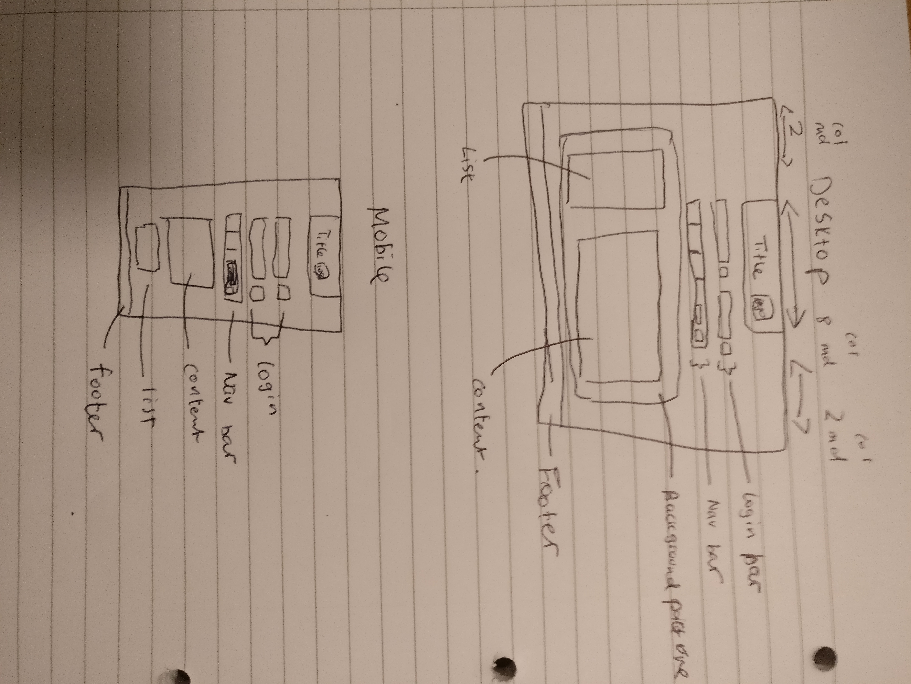

# personalWebsite

# Table of contents
1. [Introduction](#introduction)
2. [Plan](#plan)
3. [Design](#design)
4. [About](#about)
5. [Approach](#approach)
	1. [Things that went well](well)
	2. [Improvements to be made](improvements)
6. [Conclusion](#conclusion)

###Introduction
[personalWebsite](https://lauw26.github.io/personalWebsite/) is a website built using html,css and the framework bootstrap. 

###Plan
| Steps  | Task          | 
| ------ |:-------------:| 
| 1 	|Design wire frame|    
| 2 	|Download bootstrap|     
| 3 	|Create repository |    
| 4 	|Clone repository|    
| 5 	|Create html and css file for website|     
| 6 	|Implement design|
| 7    | Commit each step | 

###Wire Frame Design
**Right**: Desktop **Left**: Mobile 

###About The Webpage
The website design was intended to be a music site. The login would allow users to login and using the navigation bar would allow them to navigate the site and search for new songs.
 

###Approach 
The approach for the design was divide and conquer, one row was worked on at a time adding and spacing each element, working downwards to finish the webpage with all the design elements. Much of the difficulties comes from position and sizing the elements as well as matching with the responsive layout.

####Things that went well
* Design layout matches with product 
* Login seach takes in inputs
* Page is responsive
* List section appears under the main section in mobile form

####Improvements to be made
* More containers to allow for improvements in positiing elements
* More pictures to make the webpage for interesting
* More on positioning as elements are not perfect.
* Footer to be finished off

###Conclusion
In conclusion the webpage created resembles the wire frame design, using the divide and conquer approach implementing the webpage was more simple as it was broken down into many smaller tasks. The webpage was responsive with the main section displaying before 

[Back to top](#top)

